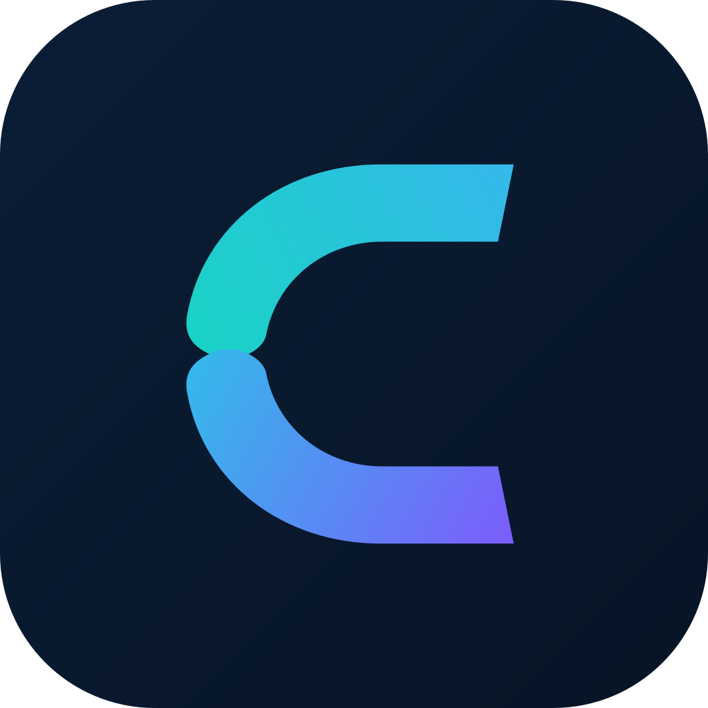
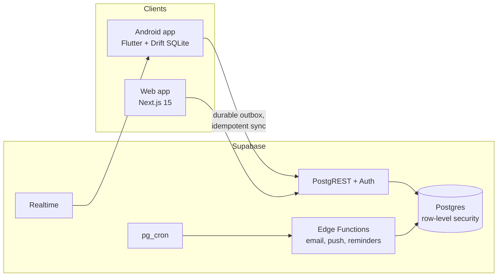

<div align="center">
  
  <h1>CLIVORA Community</h1>
  <p><strong>The open-source Freelancer OS, with a private hiring board and an offline-first Android app.</strong></p>
  <p>Run clients, projects, quotes, milestone invoices and timesheets from one account, on the web and on Android, against a Supabase backend you own.</p>

  [](LICENSE)
  [](apps/web)
  [](apps/mobile)
  [](supabase)
  [](https://github.com/UsmanGhias/clivora-os/actions/workflows/ci.yml)

  [Self-hosting](docs/self-hosting.md) · [Architecture](docs/architecture.md) · [Contributing](CONTRIBUTING.md) · [Hosted version](https://clivora.io)
</div>

## What it is

Most freelancers stitch together a marketplace for finding work, then a CRM, a project tracker, a time tracker and an invoicing tool to do it. CLIVORA puts both halves in one product:

- **A business OS.** Clients, projects, tasks, milestones, contracts, quotes, invoices, recurring invoices, credits, expenses, timesheets, a file vault and messaging.
- **A private hiring board.** Clients post needs and freelancers apply with a proposal and bid. Contact details are shared only after both sides accept, and a match turns straight into a project with milestones and invoices.
- **An Android app that works offline.** Every change is written to a local SQLite database first and synced through a durable outbox with idempotency keys and explicit conflict review, so nothing is silently overwritten.

CLIVORA never holds client funds. Clients pay freelancers directly, and both sides record payments against invoices and milestones.

## Features

| Area | Included in Community |
|---|---|
| CRM | Clients, contacts, notes, files, per-client history |
| Projects | Projects, tasks, milestones with acceptance, contracts, kanban |
| Billing | Quotes, invoices, recurring invoices, credits, expenses, public invoice links, PDF export |
| Time | Timesheets against projects, billable time to invoice lines |
| Hiring | Job board, Connect profiles, proposals, mutual-accept contact sharing, reviews |
| Collaboration | Freelancer and client workspaces, messaging, team invites, client portal |
| Mobile | Offline-first Android app, durable sync outbox, conflict review, home-screen widget |
| Platform | Postgres row-level security on every table, edge functions for email, push and reminders |

## Community and Enterprise

This repository is the **Community edition**: free, open source, and fully unlocked, with no paid tiers or usage limits.

| | Community | Enterprise |
|---|---|---|
| Everything in the table above | ✓ | ✓ |
| Admin console (moderation, platform stats, API keys) | | ✓ |
| Billing and subscriptions (payment gateways, app store purchases) | | ✓ |
| ERP sync, automation webhooks, email campaigns | | ✓ |
| AI features (SOW generation, proposal drafting, assistant) | | ✓ |

The hosted service at [clivora.io](https://clivora.io) runs the Enterprise edition.

## Architecture



More detail, including the sync model, is in [docs/architecture.md](docs/architecture.md).

## Quick start

You need Docker, the [Supabase CLI](https://supabase.com/docs/guides/cli), Node.js 20 or 22, and Flutter (stable) for the mobile app.

```bash
git clone https://github.com/UsmanGhias/clivora-os.git
cd clivora-os

supabase start                       # local Postgres, Auth and Storage, all migrations applied

cd apps/web
cp .env.example .env.local           # paste the API URL and anon key that `supabase start` printed
npm ci && npm run dev                # http://localhost:3000
```

Mobile:

```bash
cd apps/mobile
cp env/local.example.json env/local.json
flutter pub get
flutter run --dart-define-from-file=env/local.json
```

To deploy for real (hosted Supabase, email, push notifications, a signed Android build), follow [docs/self-hosting.md](docs/self-hosting.md).

## Repository layout

```text
apps/web            Next.js web app
apps/mobile         Flutter Android app
supabase/           migrations, edge functions, SQL tests
docs/               architecture and self-hosting guides
```

## Contributing

Contributions of every size are welcome: code, tests, translations, documentation and design. Start with [CONTRIBUTING.md](CONTRIBUTING.md), and look for issues labelled `good first issue`.

Report security issues privately, as described in [SECURITY.md](SECURITY.md).

## Licence

CLIVORA Community is licensed under the [GNU Affero General Public License v3.0](LICENSE). If you run a modified version as a network service, the licence requires you to offer your users its source code.

The CLIVORA name and logo are trademarks and are not covered by the code licence; see [TRADEMARKS.md](TRADEMARKS.md). Copyright and attribution are in [NOTICE](NOTICE).
